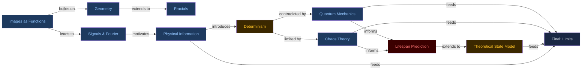

<div align="center">

# Mathematics, Information & the Modeling of Reality

**A single-page interactive educational experience exploring how equations describe images, physical systems, uncertainty, and the fundamental limits of predictability.**

[](https://nextjs.org/)
[](https://www.typescriptlang.org/)
[](https://tailwindcss.com/)
[](https://www.framer.com/motion/)
[](https://katex.org/)
[](LICENSE)
[]()
[]()

<br />

> *"The universe may be partially deterministic, fundamentally probabilistic, or computationally beyond complete forecasting — examining each possibility is where physics, mathematics, and philosophy do their most important work."*

<br />

[Live Demo](#) · [Report Bug](https://github.com/Aman-Cool/math-reality-edu/issues) · [Request Feature](https://github.com/Aman-Cool/math-reality-edu/issues)

</div>

---

## Table of Contents

- [Overview](#overview)
- [Scientific Accuracy Policy](#scientific-accuracy-policy)
- [Live Sections](#live-sections)
- [Architecture](#architecture)
  - [Component Tree](#component-tree)
  - [Data & Rendering Flow](#data--rendering-flow)
  - [Visualization Pipeline](#visualization-pipeline)
  - [Section Dependency Graph](#section-dependency-graph)
- [Tech Stack](#tech-stack)
- [Mathematical Content](#mathematical-content)
- [Interactive Visualizations](#interactive-visualizations)
- [Project Structure](#project-structure)
- [Getting Started](#getting-started)
  - [Prerequisites](#prerequisites)
  - [Installation](#installation)
  - [Development](#development)
  - [Production Build](#production-build)
- [Component Reference](#component-reference)
  - [Base Components](#base-components)
  - [Visualization Components](#visualization-components)
  - [Section Components](#section-components)
- [Design System](#design-system)
- [Performance](#performance)
- [Browser Support](#browser-support)
- [Scientific References](#scientific-references)
- [Contributing](#contributing)
- [License](#license)

---

## Overview

This project is a scientifically rigorous, single-page educational website built to explain — with full mathematical precision — how mathematics describes physical reality, where determinism breaks down, and what the true limits of prediction are in modern physics.

The site covers eleven interconnected topics, each progressively building from elementary concepts (images as functions) to advanced topics (chaos theory, quantum indeterminacy, and computational irreducibility). All speculative content is visually separated from established science using a three-tier badge system.

**Key principles:**
- Every equation rendered is mathematically correct and sourced from established physics or mathematics literature
- Speculative and philosophical content is explicitly badged and never presented as scientific consensus
- No pseudoscience, no medical misinformation, no unsupported deterministic claims about human fate
- All Canvas-based visualizations are physically motivated (e.g., logistic map divergence uses the actual recurrence relation; Lorenz attractor uses Runge-Kutta integration of the actual ODEs)

---

## Scientific Accuracy Policy

| Content Type | Badge Color | Meaning |
|---|---|---|
| `Established Science` | Green | Peer-reviewed, consensus physics or mathematics |
| `Theoretical Exploration` | Yellow | Formally defined but not practically achievable; clearly labelled thought experiments |
| `Careful / Medical` | Red | Probabilistic biology — explicitly NOT predictive of individual outcomes |
| `Historical / Philosophical` | Yellow | Pre-modern physics frameworks; deprecated by QM or chaos theory |

The site explicitly states:
- **No model can predict an individual's exact lifespan.** Actuarial and epidemiological models produce population-level probability distributions, not individual deterministic outcomes.
- **Laplace's Demon is a historical philosophical thought experiment**, not a description of how modern physics works.
- **Natural fractals are not perfect mathematical fractals** — they exhibit fractal-like statistical scaling over bounded ranges, not infinite self-similarity.

---

## Live Sections

| # | Section ID | Title | Type | Key Equation |
|---|---|---|---|---|
| 1 | `#images` | Images as Mathematical Functions | Science | `I(x,y) ∈ [0,255]` |
| 2 | `#geometry` | Geometry and Shape Representation | Science | `x² + y² = r²` |
| 3 | `#fractals` | Fractals and Emergent Complexity | Science | `z_{n+1} = z_n² + c` |
| 4 | `#signals` | Signals, Waves, and Reconstruction | Science | `F(ω) = ∫f(t)e^{-iωt}dt` |
| 5 | `#information` | Information and Physical Systems | Science | Hamilton's equations |
| 6 | `#determinism` | Determinism & Laplace's Demon | Historical/Philosophical | Classical trajectory integral |
| 7 | `#quantum` | Quantum Mechanics & Uncertainty | Science | `ΔxΔp ≥ ħ/2` |
| 8 | `#chaos` | Chaos Theory | Science | `δ(t) ≈ δ₀e^{λt}` |
| 9 | `#lifespan` | Can Lifespan Be Predicted? | Careful/Medical | Gompertz-Makeham `μ(x)` |
| 10 | `#state-model` | Theoretical Lifespan via State Modeling | Theoretical | Computational irreducibility bound |
| 11 | `#limits` | Where Mathematics Ends | Synthesis | All three limits |

---

## Architecture

### Component Tree

```mermaid
graph TD
    A[app/page.tsx] --> B[NavigationBar]
    A --> C[ProgressIndicator]
    A --> D[HeroSection]
    A --> E[ImageMathSection]
    A --> F[GeometrySection]
    A --> G[FractalsSection]
    A --> H[SignalsSection]
    A --> I[InformationSection]
    A --> J[DeterminismSection]
    A --> K[QuantumSection]
    A --> L[ChaosSection]
    A --> M[LifespanSection]
    A --> N[TheoreticalLifespanSection]
    A --> O[FinalSection]

    D --> D1[ParticleBackground]

    E --> E1[PixelGrid]
    E --> E2[EquationBlock]

    F --> F1[CircleCanvas - inline]
    F --> F2[EquationBlock]

    G --> G1[FractalViewer]
    G --> G2[EquationBlock]

    H --> H1[FourierVisualization]
    H --> H2[EquationBlock]

    J --> J1[LorenzCanvas]
    J --> J2[EquationBlock]

    K --> K1[QuantumWaveDemo]
    K --> K2[EquationBlock]

    L --> L1[ChaosSimulation]
    L --> L2[LorenzCanvas]
    L --> L3[EquationBlock]

    N --> N1[StateSpaceViz]
    N --> N2[BiologicalNetworkViz]
    N --> N3[DivergingTimelines]
    N --> N4[EquationBlock]

    style A fill:#1e3a5f,color:#fff
    style D1 fill:#1a2744,color:#93c5fd
    style E1 fill:#1a2744,color:#93c5fd
    style G1 fill:#1a2744,color:#93c5fd
    style H1 fill:#1a2744,color:#93c5fd
    style J1 fill:#1a2744,color:#93c5fd
    style K1 fill:#1a2744,color:#93c5fd
    style L1 fill:#1a2744,color:#93c5fd
    style L2 fill:#1a2744,color:#93c5fd
    style N1 fill:#1a2744,color:#93c5fd
    style N2 fill:#1a2744,color:#93c5fd
    style N3 fill:#1a2744,color:#93c5fd
```



### Data & Rendering Flow

```mermaid
flowchart LR
    subgraph Input ["User Interaction"]
        UI1[Slider / Click]
        UI2[Scroll Position]
        UI3[Canvas Click]
    end

    subgraph State ["React State"]
        S1[useState - params]
        S2[useRef - animation frame]
        S3[useRef - time accumulator]
        S4[IntersectionObserver - section]
    end

    subgraph Compute ["Computation Layer"]
        C1[Mandelbrot iteration\nchunked via setTimeout]
        C2[Logistic map\nx_{n+1}=rx_n·1-x_n]
        C3[Lorenz RK1 integration\nσ=10 ρ=28 β=8/3]
        C4[Fourier series\nΣ 4/π·2n-1 · sin·2n-1·t]
        C5[Wave packet\nGaussian × e^ikx-ωt]
        C6[Lyapunov divergence\nδ₀·e^λt paths]
    end

    subgraph Render ["Canvas Render"]
        R1[ctx.putImageData\nper-pixel color]
        R2[ctx.stroke path\nper-frame rAF]
        R3[ctx.fillRect dots\nincremental draw]
        R4[KaTeX.render\nDOM injection]
    end

    UI1 --> S1 --> C1 & C2 & C4 & C6
    UI2 --> S4 --> S1
    UI3 --> S1 --> C1
    S2 --> C3 & C4 & C5
    S3 --> C4 & C5

    C1 --> R1
    C2 --> R2
    C3 --> R3
    C4 --> R2
    C5 --> R2
    C6 --> R2
    S1 --> R4
```

### Visualization Pipeline

```mermaid
flowchart TD
    subgraph FractalViewer ["FractalViewer — Mandelbrot Set"]
        FM1[View state: cx, cy, zoom] --> FM2[scale = 3 / zoom·min·W,H]
        FM2 --> FM3[For each pixel: cx = px-W/2·scale+cx]
        FM3 --> FM4[Smooth iteration count\nz_{n+1}=z²+c until |z|>2]
        FM4 --> FM5[Escape count → RGB\n9t³·1-t, 15t²·1-t², 8.5t·1-t³]
        FM5 --> FM6[ctx.putImageData\nchunked 20 rows/frame]
        FM6 --> FM7[Canvas 560×360\nClick to zoom ×2.5]
    end

    subgraph FourierViz ["FourierVisualization — Square Wave"]
        FV1[numTerms slider 1–25] --> FV2[rAF loop — time += 0.012]
        FV2 --> FV3[Harmonics: k = 2n-1\namp = 4/π·k]
        FV3 --> FV4[Individual terms\nhsla 200+n·15 α=0.22]
        FV4 --> FV5[Reconstruction sum\nbright blue stroke]
        FV5 --> FV6[Target square wave\nsgn·sin·x dashed yellow]
    end

    subgraph ChaosViz ["ChaosSimulation — Logistic Map"]
        CV1[r slider 2.8–4.0\nδ selector 1e-2 to 1e-9] --> CV2[x₁=0.5  x₂=0.5+δ]
        CV2 --> CV3[60 iterations each\nx_{n+1}=r·x_n·1-x_n]
        CV3 --> CV4[Plot pts1 → blue\nplot pts2 → red]
        CV4 --> CV5[Static canvas re-render\non param change]
    end

    subgraph LorenzViz ["LorenzCanvas — Attractor"]
        LV1[Compute 6000 steps\ndt=0.005] --> LV2[σ=10 ρ=28 β=8/3\nEuler integration]
        LV2 --> LV3[Project x-z plane\nscale to canvas]
        LV3 --> LV4[Incremental draw\n30 pts/frame]
        LV4 --> LV5[Colour by t: rgb\n30+70t, 80+130t, 180+75t]
        LV5 --> LV6[Fade & restart\nevery 2500ms]
    end

    subgraph QWave ["QuantumWaveDemo — Wave Packet"]
        QV1[rAF loop — time += 1] --> QV2[σ·t = √σ²+ħt²/2mσ² dispersion]
        QV2 --> QV3[envelope = e^-x-center²/2σt²]
        QV3 --> QV4[|ψ|² = envelope² → blue fill]
        QV4 --> QV5[Re·ψ = envelope·cos·k₀x-t·0.08]
        QV5 --> QV6[Green stroke + Pause toggle]
    end

    subgraph DivViz ["DivergingTimelines — Lyapunov"]
        DV1[λ slider 0.1–2.0] --> DV2[14 paths: δ₀=i·0.0006]
        DV2 --> DV3[δ·t = δ₀·e^λ·s·0.04 per step]
        DV3 --> DV4[y += sin wave + δ·H·0.9]
        DV4 --> DV5[Hue: 220 - |t0|·195\nblue → red outer]
        DV5 --> DV6[Animated draw 3 steps/frame\nloop at STEPS+90]
    end
```

### Section Dependency Graph



---

## Tech Stack

| Layer | Technology | Version | Purpose |
|---|---|---|---|
| Framework | Next.js (App Router) | 14.2.15 | SSG, routing, image optimization |
| Language | TypeScript | 5.x | Type safety across all 31 source files |
| Styling | Tailwind CSS | 3.4 | Utility-first dark-theme design system |
| Animation | Framer Motion | 11.x | Scroll-triggered reveals, hero entrance, nav slide |
| Math Rendering | KaTeX | 0.16 | LaTeX equation rendering via DOM injection |
| Visualization | Canvas 2D API | Native | All 7 interactive simulations — no WebGL dependency |
| Intersection | IntersectionObserver | Native | Active nav highlighting, scroll-reveal triggers |
| Build | Next.js static export | — | Prerendered, no server runtime required |

**Deliberately excluded:**
- **No Three.js / WebGL** — All visualizations use Canvas 2D for maximum compatibility and zero bundle overhead from a 3D engine
- **No React Three Fiber** — The Lorenz attractor is rendered as a 2D x–z projection on Canvas
- **No external chart library** — All graphs are hand-authored on Canvas for full visual control and scientific accuracy

---

## Mathematical Content

All equations are rendered client-side via `katex.render()` with `displayMode: true` for block equations.

### Equations Covered

| Topic | LaTeX | Physical Meaning |
|---|---|---|
| Image function | `I(x,y) \in [0,255]` | Grayscale intensity at pixel coordinate |
| RGB image | `\mathbf{I}(x,y) = (R,G,B)^T` | Vector-valued color function |
| Sampling theorem | `f_s \geq 2f_{\max}` | Nyquist condition for alias-free sampling |
| Circle (implicit) | `x^2 + y^2 = r^2` | Locus of points equidistant from origin |
| Circle (parametric) | `x(t)=r\cos t,\ y(t)=r\sin t` | Equivalent parametric form |
| Mandelbrot | `z_{n+1} = z_n^2 + c` | Complex quadratic iteration |
| Fourier transform | `F(\omega)=\int f(t)e^{-i\omega t}dt` | Decomposition into frequency components |
| Fourier series (square wave) | `\sum \frac{4}{\pi(2n-1)}\sin((2n-1)t)` | Harmonic reconstruction |
| Hamilton's equations | `\dot q = \partial H/\partial p,\ \dot p = -\partial H/\partial q` | Classical phase-space dynamics |
| Newton's second law | `\ddot x = F(x,t)/m` | Second-order ODE — classical determinism |
| Classical trajectory | `\mathbf{x}(t)=\mathbf{x}_0+\int_0^t\mathbf{v}\,d\tau` | Laplace's Demon theoretical basis |
| Heisenberg uncertainty | `\Delta x\,\Delta p \geq \hbar/2` | Fundamental quantum limit — not measurement error |
| Born rule | `P(a\leq x\leq b)=\int_a^b|\Psi|^2\,dx` | Probabilistic interpretation of wavefunction |
| Schrödinger equation | `i\hbar\partial_t\Psi = \hat H\Psi` | Deterministic wavefunction evolution |
| Lyapunov divergence | `\delta(t)\approx\delta_0 e^{\lambda t}` | Exponential error growth in chaos |
| Predictability horizon | `T_{\max}\approx\lambda^{-1}\ln(\Delta/\delta_0)` | Maximum reliable forecast window |
| Logistic map | `x_{n+1}=rx_n(1-x_n)` | Discrete chaotic dynamical system |
| Lorenz system | `\dot x=\sigma(y-x),\ \dot y=x(\rho-z)-y,\ \dot z=xy-\beta z` | Strange attractor, σ=10 ρ=28 β=8/3 |
| Gompertz-Makeham | `\mu(x)=A+Be^{Cx}` | Empirical population mortality rate |
| Survival function | `S(x)=\exp(-\int_0^x\mu\,dt)` | Population-level survival probability |
| Total state vector | `\mathbf{S}(t)\in\mathbb{R}^N,\ N\approx 10^{28}` | Hypothetical classical state dimensionality |
| Computational irreducibility | `T_{\text{compute}}(t)\geq T_{\text{physical}}(t)` | Lower bound on prediction time |
| Quantum time evolution | `|\Psi(t)\rangle=e^{-i\hat Ht/\hbar}|\Psi(0)\rangle` | Unitary evolution operator |

---

## Interactive Visualizations

### `PixelGrid`
Renders a continuous circular gradient function `I(x,y)` discretized into an N×N sample grid. Each cell shows its integer intensity value `⌊255·I⌋`. Toggle between 8×8, 12×12, and 20×20 grids to illustrate the sampling/resolution tradeoff.

### `FractalViewer`
Full Mandelbrot set renderer using smooth (continuous) iteration count coloring to eliminate color banding. Renders in chunks of 20 rows per `setTimeout` tick to keep the UI thread responsive. Click any region to zoom in (×2.5 per click), re-centering at the clicked complex coordinate. Shows current zoom factor and center coordinates in real time.

### `FourierVisualization`
Animated Fourier series reconstruction of a square wave. A `requestAnimationFrame` loop advances a phase parameter producing a travelling-wave effect. A slider from 1–25 controls the number of harmonics summed. Renders three overlaid plots: individual harmonics (dim), the running reconstruction (bright blue), and the ideal target (dashed yellow).

### `LorenzCanvas`
Computes 6,000 steps of the Lorenz system using forward Euler integration (`dt = 0.005`) with parameters σ=10, ρ=28, β=8/3. Projects the 3D trajectory onto the x–z plane and scales to fill the canvas. Draws incrementally at 30 points per frame, colour-shifting from indigo to cyan as the trajectory advances. Fades and restarts every 2.5 seconds to show the full attractor continuously.

### `ChaosSimulation`
Iterates the logistic map `x_{n+1} = r·x_n·(1−x_n)` for two trajectories with starting values `x₀ = 0.5` and `x₀ = 0.5 + δ`. A slider controls `r ∈ [2.8, 4.0]` (chaos onset near r ≈ 3.57). A dropdown selects the initial separation `δ` from `10⁻²` down to `10⁻⁹`. The canvas re-renders on every parameter change, static — no animation loop — for maximum clarity.

### `QuantumWaveDemo`
Renders a Gaussian wave packet `ψ(x,t) = envelope·exp(ik₀x − iωt)` with time-dependent spreading `σ(t) = √(σ² + (ħt/2mσ)²)`. Two simultaneous plots: `|ψ|²` (probability density, blue fill) and `Re[ψ]` (oscillating carrier, green stroke). A Pause/Resume button halts the animation for inspection. Displays the current packet width σ(t) in real time.

### `StateSpaceViz`
A canvas animation of 10 body-system nodes (Neural, Sensory, Endocrine, Cardiac, Immune, Metabolic, Cellular, Genetic, Environmental, Quantum) arranged in a loose body topology. Each node has a colour-coded radial glow pulsing at its own phase. Bidirectional flow particles travel along connection edges. Labels include biological scale figures (e.g., "~86B neurons", "~37T cells").

### `BiologicalNetworkViz`
44 slowly drifting nodes across 5 categories (Neuronal, Immune, Metabolic, Genetic, Cellular). Proximity-based edges (threshold 75 px) appear and fade dynamically as nodes move. Pulsing glow per node proportional to a per-node sinusoidal phase. Legend auto-rendered in the bottom-left corner.

### `DivergingTimelines`
14 timeline paths computed with `δ(t) = δ₀·exp(λ·s·0.04)` per step, where δ₀ = `i × 0.0006`. Colour gradient from blue (central lines, δ₀ ≈ 0) to red (outer lines, δ₀ = ±0.0078). Animated: paths draw themselves left-to-right over ~73 frames then loop. An interactive λ slider (0.1–2.0) recomputes all paths and restarts the animation.

---

## Project Structure

```
math-reality-edu/
│
├── app/                              # Next.js App Router root
│   ├── globals.css                   # Tailwind directives, KaTeX overrides, badge classes
│   ├── layout.tsx                    # Root layout — metadata, KaTeX CSS import, Google Fonts
│   └── page.tsx                      # Main page — assembles all 11 sections with dividers
│
├── components/
│   ├── EquationBlock.tsx             # KaTeX block + inline renderers with GlassCard wrapper
│   ├── GlassCard.tsx                 # Reusable frosted-glass card, 5 accent color variants
│   ├── HeroSection.tsx               # Full-screen hero — title, subtitle, CTA buttons, scroll cue
│   ├── NavigationBar.tsx             # Sticky nav — IntersectionObserver active highlighting, mobile menu
│   ├── ParticleBackground.tsx        # Canvas: 35 drifting math symbols + 80 networked dot particles
│   ├── ProgressIndicator.tsx         # Gradient reading-progress bar, fixed top, z-60
│   ├── SectionWrapper.tsx            # Framer Motion scroll-reveal wrapper + SectionHeading component
│   │
│   ├── sections/                     # One file per educational section
│   │   ├── ImageMathSection.tsx      # Images as mathematical functions — I(x,y), RGB, sampling
│   │   ├── GeometrySection.tsx       # Implicit/parametric equations — interactive circle with slider
│   │   ├── FractalsSection.tsx       # Mandelbrot, self-similarity, natural fractal caveats
│   │   ├── SignalsSection.tsx        # Fourier transform, reconstruction, MRI/CT/radio astronomy
│   │   ├── InformationSection.tsx    # Phase space, Hamilton's equations, system complexity hierarchy
│   │   ├── DeterminismSection.tsx    # Laplace's Demon — PHILOSOPHICAL badge, refutations listed
│   │   ├── QuantumSection.tsx        # QM, Born rule, Schrödinger, uncertainty, decoherence
│   │   ├── ChaosSection.tsx          # Lyapunov, logistic map, Lorenz, predictability horizon
│   │   ├── LifespanSection.tsx       # CAREFUL badge — probabilistic only, no individual prediction
│   │   ├── TheoreticalLifespanSection.tsx  # THEORETICAL badge — 8-subsection speculative deep-dive
│   │   └── FinalSection.tsx          # Synthesis — three limits, summary table, closing reflection
│   │
│   └── visualizations/               # Self-contained Canvas-based interactive components
│       ├── PixelGrid.tsx             # Discrete sampling of continuous function — 3 grid sizes
│       ├── FractalViewer.tsx         # Mandelbrot renderer — chunked, smooth coloring, click-to-zoom
│       ├── FourierVisualization.tsx  # Animated Fourier reconstruction — 1–25 harmonics slider
│       ├── LorenzCanvas.tsx          # Lorenz attractor — incremental draw, x-z projection
│       ├── ChaosSimulation.tsx       # Logistic map — two trajectories, r and δ controls
│       ├── QuantumWaveDemo.tsx       # Gaussian wave packet — |ψ|² and Re[ψ], pause/resume
│       ├── StateSpaceViz.tsx         # Body-system node graph — flow particles, pulsing glow
│       ├── BiologicalNetworkViz.tsx  # Drifting biological network — 44 nodes, 5 categories
│       └── DivergingTimelines.tsx    # Lyapunov timeline divergence — λ slider, colour gradient
│
├── next.config.mjs                   # Minimal Next.js config
├── tailwind.config.ts                # Extended palette, font-mono, bg-gradient-radial
├── tsconfig.json                     # Strict TypeScript, bundler module resolution
├── postcss.config.js                 # Tailwind + Autoprefixer
└── package.json                      # Dependencies — no Three.js, no chart libraries
```

---

## Getting Started

### Prerequisites

- **Node.js** ≥ 18.17 (required by Next.js 14)
- **npm** ≥ 9 (or yarn / pnpm)

Verify your environment:
```bash
node --version   # v18.17.0 or higher
npm --version    # 9.x or higher
```

### Installation

```bash
# Clone the repository
git clone https://github.com/Aman-Cool/math-reality-edu.git
cd math-reality-edu

# Install dependencies
npm install
```

> **No additional setup required.** There are no environment variables, no external APIs, and no database connections. All computation is client-side.

### Development

```bash
npm run dev
```

Open [http://localhost:3000](http://localhost:3000). The development server supports Fast Refresh — edits to any component reflect immediately without full page reload.

**Useful dev flags:**

```bash
# Run on a custom port
npm run dev -- -p 3001

# Verbose build output
npm run build -- --debug
```

### Production Build

```bash
# Build optimized static output
npm run build

# Serve the production build locally
npm run start
```

Expected build output:
```
Route (app)            Size     First Load JS
┌ ○ /                  124 kB          211 kB
└ ○ /_not-found        873 B            88 kB
+ First Load JS shared 87.1 kB
```

The output is fully static (`○` = prerendered). Deploy to any static host: Vercel, Netlify, GitHub Pages, or a plain CDN.

---

## Component Reference

### Base Components

#### `EquationBlock`
```tsx
<EquationBlock
  math="F(\omega) = \int_{-\infty}^{\infty} f(t)\,e^{-i\omega t}\,dt"
  label="Continuous Fourier Transform"
  description="F(ω) gives the amplitude and phase of each frequency component."
  display={true}    // true = block (centered), false = inline
/>
```
Renders LaTeX via `katex.render()` injected into a `useRef<HTMLDivElement>`. Wrapped in `GlassCard` with blue accent. Safe: catches KaTeX parse errors and falls back to raw LaTeX string.

#### `InlineMath`
```tsx
<p>The probability density is <InlineMath math="|\Psi(x,t)|^2" /> at each point.</p>
```
Lightweight inline variant — bare `<span>` with `katex.render()`, no card wrapper.

#### `GlassCard`
```tsx
<GlassCard accent="blue" className="my-4">
  {/* content */}
</GlassCard>
```
Accent variants: `blue` · `yellow` · `green` · `red` · `none`. Applies `bg-{color}/[0.04] border-{color}/20 backdrop-blur-sm rounded-2xl`.

#### `SectionWrapper`
```tsx
<SectionWrapper id="chaos">
  {/* section content */}
</SectionWrapper>
```
Wraps content in a `<section>` tag with `id`, `max-w-6xl mx-auto`, and a Framer Motion `useInView` fade-up triggered once on scroll entry (margin: -80px).

#### `SectionHeading`
```tsx
<SectionHeading
  badge="Established Science · Nonlinear Dynamics"
  badgeVariant="science"       // "science" | "speculative" | "careful"
  title="Chaos Theory"
  subtitle="Deterministic equations can produce behavior that is, in practice, impossible to predict."
/>
```

### Visualization Components

All visualization components:
- Are `'use client'` — Canvas API requires browser environment
- Clean up `requestAnimationFrame` IDs via `useEffect` return function
- Are responsive: canvas CSS width is `w-full`, pixel dimensions set as attributes
- Accept no required props (all state is internal) unless documented otherwise

| Component | Canvas Size | Interactive Controls | Loop |
|---|---|---|---|
| `PixelGrid` | 420×320 | Grid size toggle (3 options) | No |
| `FractalViewer` | 560×360 | Click to zoom, Reset button | No |
| `FourierVisualization` | 600×240 | Harmonics slider 1–25 | Yes |
| `LorenzCanvas` | 520×300 | None | Yes |
| `ChaosSimulation` | 580×280 | r slider, δ dropdown | No |
| `QuantumWaveDemo` | 600×200 | Pause/Resume | Yes |
| `StateSpaceViz` | 320×480 | None | Yes |
| `BiologicalNetworkViz` | 580×200 | None | Yes |
| `DivergingTimelines` | 580×210 | λ slider 0.1–2.0 | Yes |

### Section Components

All section components are **server components** (no `'use client'`) unless they include inline interactive elements (e.g., `GeometrySection` contains an inline `CircleCanvas`). They import and compose base components and visualizations.

---

## Design System

### Color Palette

| Token | Hex | Usage |
|---|---|---|
| Background | `#0a0f1e` | Page background, nav on scroll |
| Surface | `rgba(255,255,255,0.03)` | GlassCard background |
| Border | `rgba(255,255,255,0.07)` | GlassCard default border |
| Blue 400 | `#60a5fa` | Primary accent, active nav, visualizations |
| Blue 300 | `#93c5fd` | Secondary text, equation color |
| Cyan 300 | `#67e8f9` | Gradient endpoint, quantum visualization |
| Yellow 400 | `#fbbf24` | Speculative badge, theoretical accents |
| Red 400 | `#f87171` | Medical/careful badge, chaos trajectory |
| Green 400 | `#34d399` | Established science badge |
| Gray 400 | `#9ca3af` | Body text |
| Gray 600 | `#4b5563` | Captions, secondary labels |

### Typography

| Role | Class | Spec |
|---|---|---|
| Display heading | `text-5xl md:text-7xl font-bold tracking-tight` | Inter, 700 |
| Section heading | `text-3xl md:text-4xl font-bold` | Inter, 700 |
| Body | `text-gray-300 leading-relaxed` | Inter, 400, 1.625 line-height |
| Caption | `text-xs text-gray-600` | Inter, 400 |
| Code / equation labels | `font-mono text-xs tracking-widest` | JetBrains Mono / system monospace |
| KaTeX output | `.katex { color: #bfdbfe }` | KaTeX default font, blue tinted |

### Badge Classes (globals.css)

```css
.speculative-badge   /* yellow — theoretical/philosophical content */
.science-badge       /* green  — established, peer-reviewed science */
.careful-badge       /* red    — medical/probabilistic — handle carefully */
```

---

## Performance

| Metric | Value | Notes |
|---|---|---|
| First Load JS | 211 kB | Includes Framer Motion (53 kB) and KaTeX (31 kB) |
| Page JS | 124 kB | Section + visualization code |
| Build output | Static (`○`) | No server runtime; CDN-deployable |
| Canvas visualizations | 60 fps target | `requestAnimationFrame` — degrades gracefully |
| Mandelbrot render | Chunked | 20 rows/`setTimeout` — non-blocking |
| TypeScript errors | 0 | Strict mode, all files checked |

**Canvas performance notes:**
- All animations use `requestAnimationFrame` and cancel via returned cleanup function in `useEffect`
- The Mandelbrot renderer uses chunked rendering via `setTimeout(renderChunk, 0)` to keep the main thread free during interactive zooms
- Heavy `useEffect` computations (Lorenz integration, timeline path generation) run once on mount, not per frame
- `useRef` is used for time accumulators to avoid re-renders on each animation tick

---

## Browser Support

| Browser | Version | Status |
|---|---|---|
| Chrome / Edge | ≥ 90 | Full support |
| Firefox | ≥ 90 | Full support |
| Safari | ≥ 15 | Full support |
| Mobile Chrome (Android) | ≥ 90 | Full support |
| Mobile Safari (iOS) | ≥ 15 | Full support — touch interactions work |
| IE 11 | — | Not supported (ES2020+, Canvas API required) |

All visualizations use the Canvas 2D API (`CanvasRenderingContext2D`), which is universally supported in modern browsers. No WebGL, no WebAssembly, no native modules.

---

## Scientific References

All mathematical content is grounded in established literature:

| Topic | Primary Reference |
|---|---|
| Fourier analysis | Stein, E. & Shakarchi, R. — *Fourier Analysis: An Introduction* (Princeton, 2003) |
| Mandelbrot set | Mandelbrot, B. — *The Fractal Geometry of Nature* (Freeman, 1982) |
| Lorenz attractor | Lorenz, E. N. — *Deterministic Nonperiodic Flow*, J. Atmos. Sci. **20**, 130 (1963) |
| Chaos & Lyapunov | Strogatz, S. — *Nonlinear Dynamics and Chaos* (Westview, 2nd ed., 2015) |
| Quantum mechanics | Griffiths, D. — *Introduction to Quantum Mechanics* (Cambridge, 3rd ed., 2018) |
| Heisenberg uncertainty | Robertson, H. P. — Phys. Rev. **34**, 163 (1929) — formal proof |
| Bell inequalities | Bell, J. S. — *On the Einstein Podolsky Rosen Paradox*, Physics **1**, 195 (1964) |
| Laplace's Demon | Laplace, P.S. — *A Philosophical Essay on Probabilities* (Springer, 1902 translation) |
| Gompertz-Makeham | Makeham, W. M. — J. Inst. Actuaries **8**, 301 (1860) |
| Computational irreducibility | Wolfram, S. — *A New Kind of Science* (Wolfram Media, 2002) Ch. 12 |
| Emergent complexity | Anderson, P. W. — *More is Different*, Science **177**, 393 (1972) |
| Quantum biology | Lambert, N. et al. — *Quantum biology*, Nature Physics **9**, 10 (2013) |
| Nyquist–Shannon | Shannon, C. E. — *Communication in the Presence of Noise*, Proc. IRE **37**, 10 (1949) |

---

## Contributing

Contributions are welcome, provided they maintain scientific accuracy.

```bash
# Fork and clone
git clone https://github.com/Aman-Cool/math-reality-edu.git
cd math-reality-edu
npm install

# Create a feature branch
git checkout -b feature/your-topic

# Make changes, then verify
npx tsc --noEmit        # must pass with zero errors
npm run build           # must produce a clean static build

# Commit and push
git commit -m "Add <topic>"
git push origin feature/your-topic
```

**Contribution guidelines:**
- All new equations must be mathematically correct and sourced
- Speculative content must carry a `speculative-badge` or `careful-badge`
- No claims of exact biological prediction or medical diagnosis
- Canvas visualizations must implement `cancelAnimationFrame` cleanup
- TypeScript strict mode must remain satisfied (`tsc --noEmit` → zero errors)

---

## License

MIT License — see [LICENSE](LICENSE) for details.

---

<div align="center">

Built for educational purposes · No medical claims · Speculative content clearly labelled

</div>
